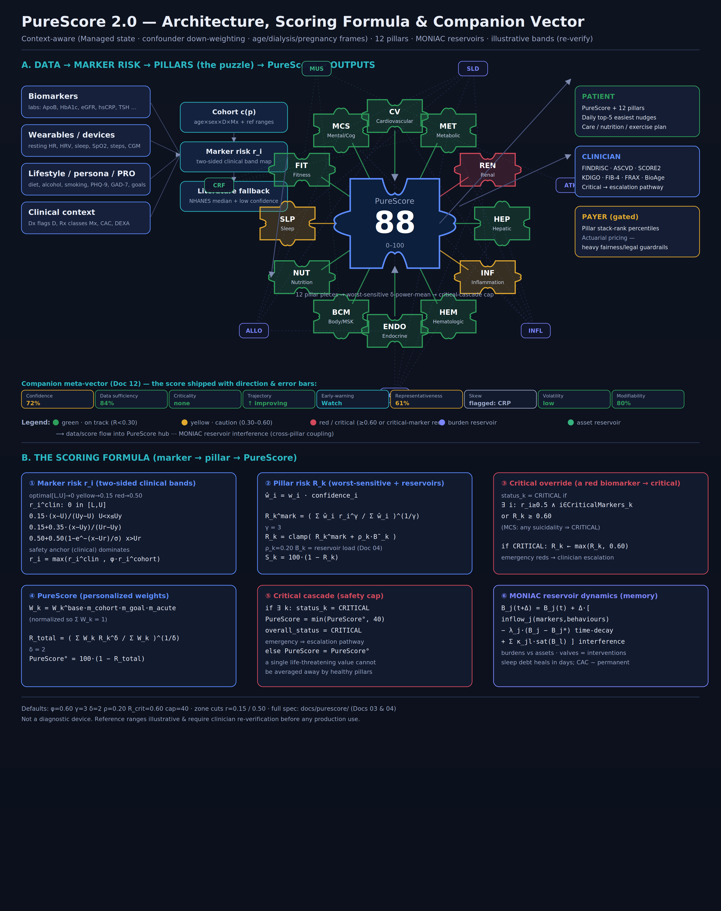

# PureScore — A Comprehensive, Sex-Specific, Multi-Pillar Health & Wellbeing Scoring System

**Status:** Design specification (v0.1) — *not yet implemented, not yet clinically validated.*
**Positioning:** Wellness-grade, clinician-in-the-loop. PureScore is **not** a diagnostic
medical device and makes **no** autonomous diagnostic or treatment claims. Every critical
state escalates to a human clinician.
**Audience of this score:** patients (primary). Derived clinical and actuarial layers serve
clinicians and payers and are *gated* behind separate access and governance.

---

## 1. What PureScore is

*Overall architecture + formula at a glance (source: `assets/render_diagram.py`; interactive
version: `purescore-architecture.html`).*

PureScore is a single 0–100 number, decomposed into **12 health pillars**, each built from a
tiered catalogue of **biomarkers, wearable signals, and lifestyle/persona inputs**. It is
personalized to a patient's **cohort** (age band × sex × disease flags × medication flags) and
to their **life stage** and **goals**.

When the system has the patient's own data it uses it. When it does not, it falls back to
**literature-derived medians and percentiles** for that cohort (NHANES, UK-Biobank-class
distributions, and guideline reference ranges) so a score can always be produced, with an
explicit **confidence/coverage** annotation.

Three properties make PureScore more than a weighted average of lab values:

1. **Clinical safety anchor + personalized stack-rank.** Each marker is scored against both an
   absolute clinical "optimal band" (so we never call someone healthy just because they look
   normal *for a sick cohort*) **and** their cohort percentile (so the score feels personal and
   can rank progress). The clinical anchor always dominates for safety.
2. **Critical cascade.** A single red biomarker can make its pillar *critical*, and a critical
   pillar cascades PureScore into the critical zone. The score cannot be "averaged away" from a
   life-threatening value.
3. **MONIAC reservoir dynamics.** Like the Phillips/MONIAC hydraulic economic computer, the
   system models **reservoirs** (accumulated burdens and reserves — sleep debt, atherogenic
   burden, inflammatory load, cardiorespiratory reserve, etc.) connected by **pipes**
   (cross-pillar interference), drained by **leakage** (time-decay/healing), and controlled by
   **valves** (interventions/knobs). This gives PureScore *memory*: a chronically accumulated
   burden is reflected even when a single spot value looks acceptable, and a single good day
   does not erase a chronic debt.

---

## 2. Document map

| # | Document | Owner-authored spine? | Contents |
|---|----------|:--:|----------|
| — | `README.md` | ✔ | This index, conventions, glossary |
| 00 | `00-vision-principles-and-lessons.md` | ✔ | Vision, design principles, lessons from Babylon Health, Kaiser Permanente, Mayo Clinic |
| 01 | `01-data-model-and-reference-ranges.md` | ✔ | Canonical data model (FHIR-aligned), tier definitions, literature reference-range strategy |
| 02 | `02-pillars-and-marker-catalog.md` | ✔ | The 12 pillars; full marker catalogue with tiers and green/yellow/red bands |
| 03 | `03-scoring-formula.md` | ✔ | Core mathematics: marker → pillar → PureScore, critical cascade |
| 04 | `04-moniac-reservoir-dynamics.md` | ✔ | Reservoirs, time-decay, interference/coupling matrix, asset vs burden |
| 05 | `05-sex-specific-models.md` |  | Female vs male models: cycle, fertility, pregnancy, post-partum, menopause; male andropause |
| 06 | `06-acute-events-and-life-stage-plans.md` |  | Acute-event override & revert; care/nutrition/exercise plans by life stage |
| 07 | `07-daily-nudge-engine.md` |  | Daily top-5 easiest actions, impact attribution to PureScore/pillars |
| 08 | `08-clinical-scores-integration.md` |  | FINDRISC, ASCVD/SCORE2, KDIGO, FIB-4, FRAX, PhenoAge/BioAge for clinicians |
| 09 | `09-cohort-percentiles-and-validation.md` |  | Cohort construction, empirical-Bayes shrinkage, calibration, fairness, drift |
| 10 | `10-actuarial-pricing-and-insurance.md` |  | Full pricing engine **with heavy regulatory/fairness risk flags** |
| 11 | `11-safety-governance-and-regulatory.md` |  | Clinician-in-loop, escalation, equity, privacy, model governance |
| 12 | `12-critical-review-and-purescore-2.0.md` | ✔ | Edge-case critique + PureScore 2.0: context-aware interpretation, companion meta-vector, personal-baseline early-warning, dual framing, bias handling |

Read 00 → 04 first; they define everything the later documents depend on.

---

## 3. Canonical conventions (used by every document)

These symbols and definitions are **binding** across all PureScore documents.

### 3.1 Indices and sets
- `p` — patient. `t` — time (days, unless noted). `Δ` — update interval.
- `i ∈ M` — a marker (biomarker, wearable signal, or lifestyle/persona metric).
- `k ∈ {1..12}` — a pillar (see §3.4).
- `j ∈ R` — a reservoir (Doc 04).
- `c(p)` — patient's **cohort**: a stratum `(age_band, sex, D, Mx)` where `D` is the set of
  active disease flags and `Mx` the set of active medication classes.

### 3.2 Per-marker quantities
- `x_i(t)` — raw measured value.
- `[L_i^opt, U_i^opt]` — **green/optimal band** (cohort- and guideline-specific).
- yellow/caution and red/critical bands extend outward (two-sided for U-shaped markers).
- `q_i = F_{i,c}(x_i)` — **cohort percentile** of the value (`F` = cohort CDF).
- `r_i ∈ [0,1]` — **marker risk** (0 = optimal, 1 = maximally adverse). `r_i ≥ 0.5` ⇒ red.
- `s_i = 100·(1 − r_i)` — **marker sub-score** (0–100).
- `w_i` — clinical weight of marker within its pillar.
- `tier(i) ∈ {Core, Peripheral, Comprehensive}` — measurement tier (Doc 01 §3).

### 3.3 Per-pillar and overall quantities
- `R_k ∈ [0,1]` — pillar risk; `S_k = 100·(1 − R_k)` — **pillar score**.
- `status_k ∈ {green, yellow, red/critical}`.
- `W_k` — pillar weight in PureScore (personalized; Doc 03 §5).
- `R_total`, **`PureScore = 100·(1 − R_total)`**.

### 3.4 The 12 pillars (binding order and IDs)
1. **CV** — Cardiovascular & Vascular (incl. blood pressure, ApoB/LDL, Lp(a), CAC)
2. **MET** — Metabolic & Glycemic (glucose, HbA1c, insulin resistance, weight regulation)
3. **REN** — Renal
4. **HEP** — Hepatic
5. **INF** — Inflammation & Immune
6. **HEM** — Hematologic & Oxygen Transport
7. **ENDO** — Endocrine & Hormonal (sex-specific; see Doc 05)
8. **BCM** — Body Composition & Musculoskeletal (incl. bone density, sarcopenia)
9. **NUT** — Nutrition & Micronutrients
10. **SLP** — Sleep & Circadian Recovery
11. **FIT** — Physical Activity & Cardiorespiratory Fitness
12. **MCS** — Mental, Cognitive & Social Health

### 3.5 Band/zone colour semantics (binding)
- **Green** = at/near clinical optimum, `r_i < 0.15`.
- **Yellow** = caution / sub-optimal / early risk, `0.15 ≤ r_i < 0.5`.
- **Red / critical** = clinically concerning, `r_i ≥ 0.5`; triggers pillar-critical evaluation
  and clinician escalation pathway (Doc 11).

---

## 4. Glossary
- **Cohort / persona** — the reference group for percentile and median fallback.
- **Reservoir (stock)** — an accumulated latent burden or reserve with memory (Doc 04).
- **Burden vs asset** — reservoirs that *raise* risk (burden) vs *lower* it (reserve/asset).
- **Leakage (λ)** — rate at which a reservoir drains/heals when inputs normalize.
- **Interference (κ)** — cross-pillar coupling: one reservoir feeding another.
- **Critical cascade** — propagation of a critical marker → pillar → PureScore.
- **Acute mode** — temporary re-prioritization toward an acute life event (Doc 06).
- **Coverage/confidence** — fraction of a pillar's weighted markers backed by *the patient's own*
  recent data vs literature fallback.

---

## 5. Hard non-negotiables (safety)
1. PureScore never replaces a clinician. Red/critical ⇒ human escalation.
2. The clinical optimal band always dominates the cohort percentile for safety.
3. Every score is **explainable**: each number can be traced to its inputs and weights.
4. Uncertainty defaults to caution, never to reassurance.
5. No protected-class attribute (or proxy) may be used to *worsen* access, pricing, or care.
6. Reference ranges and guideline thresholds in these documents are **literature-anchored as of
   the cited guidelines and must be re-verified on a fixed cadence** before any production use.
